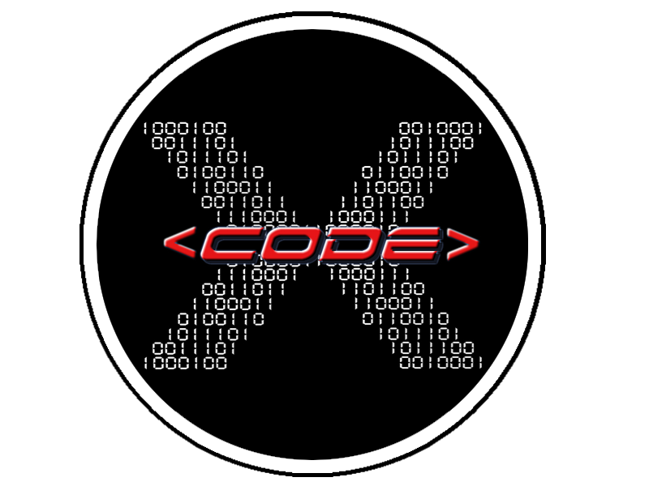
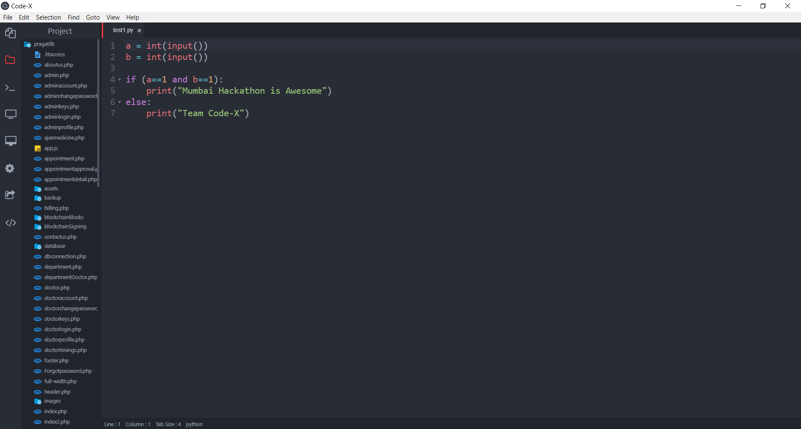
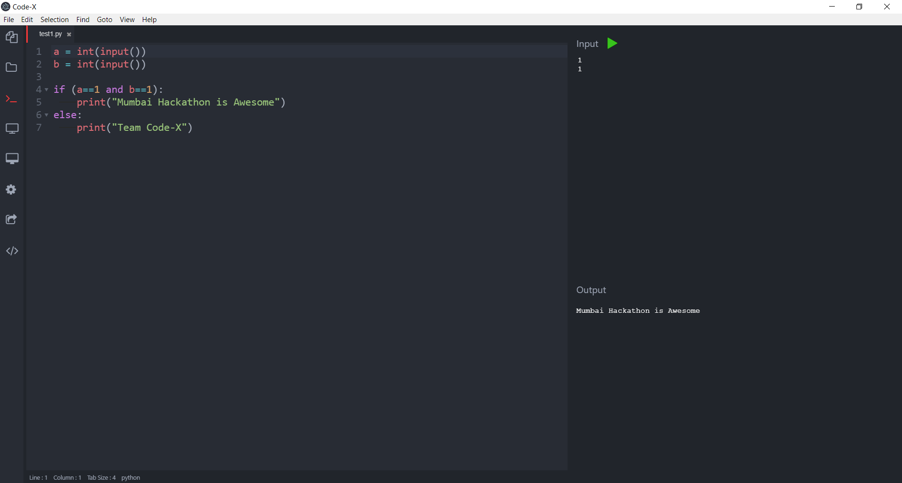
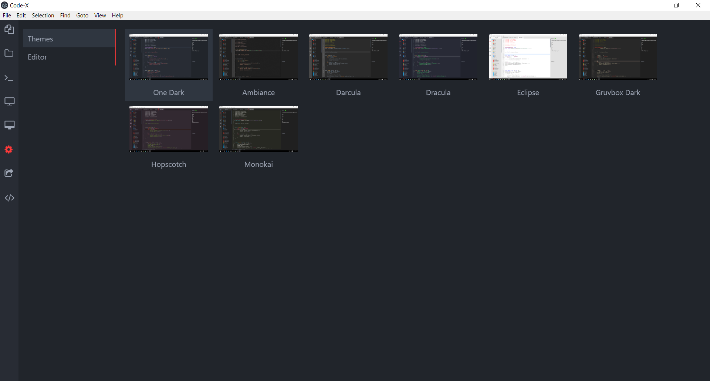
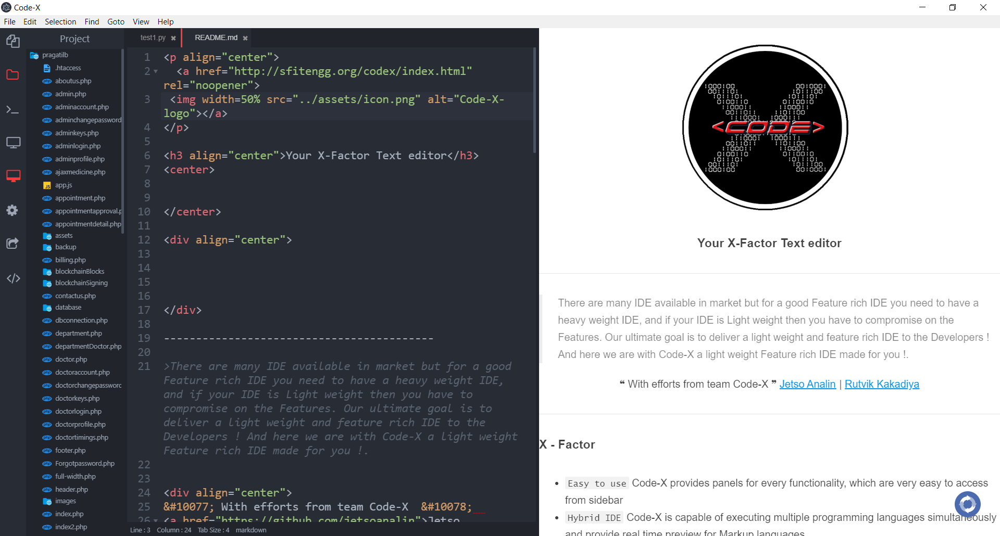
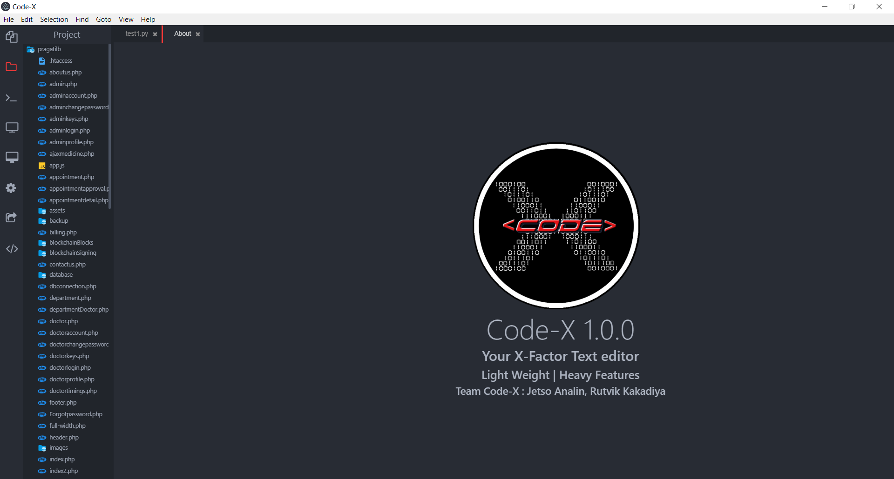

<p align="center">
  <a href="http://sfitengg.org/codex/index.html" rel="noopener">
 </a>
</p>

<h3 align="center">Your X-Factor Text editor</h3>
<center>


</center>

<div align="center">


</div>

------------------------------------------

>There are many IDE available in market but for a good Feature rich IDE you need to have a heavy weight IDE, and if your IDE is Light weight then you have to compromise on the Features. Our ultimate goal is to deliver a light weight and feature rich IDE to the Developers ! And here we are with Code-X a light weight Feature rich IDE made for you !.


<div align="center">
&#10077; With efforts from team Code-X  &#10078;  
<a href="https://github.com/jetsoanalin">Jetso Analin</a> | <a href="https://github.com/rutvikbk">Rutvik Kakadiya</a>
</div>


------------------------------------------
### X - Factor

- `Easy to use` Code-X provides panels for every functionality, which are very easy to access from sidebar
- `Hybrid IDE` Code-X is capable of executing multiple programming languages simultaneously and provide real time preview for Markup languages
- `Customizability` Code-X provide various settings and themes, which you can changes very easily


<div align="center">

<h3 > Simple and Clean design</h3>
<br>
<p align="center">

</p>

<h3>A text editor that doubles as an IDE for those who need that additional X-factor </h3>
<br>
<p align="center">

</p>

<h3>Bored of the same UI? Play with our different UI themes</h3>
<br>
<p align="center">

</p>

<h3>And Many other features only on our IDE Code-X</h3>
<br>
<p align="center">


</p>


</div>

------------------------------------------
# Features :


  🌟 Full Featured Editor <br>
  🌟 Syntax Highlighting <br>
  🌟 Autocompletion <br>
  🌟 Code Folding <br>
  🌟 Themes <br>
  🌟 Autocompletion <br>
  🌟 Templates For Specific File Extension <br>
  🌟 Project Management <br>
  🌟 Console (for variour programming languages over 10+) <br>
  🌟 Real Time Preview for Markup Languages (HTML, MD) <br>
  🌟 Real Time Code Sharing <br>
  🌟 Easy UI <br>

## 🌟 And More Important - Its Light Weight Heavy Featured IDE !

------------------------------------------

# Libraries used :


🌟 [NodeJs] - evented I/O for the backend <br>
🌟 [codemirror] - Programing language support <br>
🌟 [localtunnel] - library to tunnel localhost <br>
🌟 [socket.io] - for bidirectional communication <br>


------------------------------------------
# Installation ! :heart:
## Are you a Windows user? or Linux user ? or a Mac user ?
### Dont worry we got your back ! Meet [Electron](https://electronjs.org/) You i'll fall in love with it !

> Electron requires [Node.js](https://nodejs.org/) to run.

### Wondering How to Install??
#### Follow these 2 easy steps !!
##### 1. Download the repository

Clone the base repository onto your desktop with `git` as follows:
```console
git clone git@github.com:jetsoanalin/codex-ide
```

### What Do you think the next step will be ??

##### 2. Congratulations !!! You are almost about to run the app in any environment! it's just as simple as that :smile: .

🌟 Yeaayyy you are about to experience your X-Factor !!!! 🌟

```sh
$ cd codex-ide
$ npm install
$ electron . or npm start
```


### Please Note

- This project was done in `Minimal time from START` so we are open for bug reporting and fixing !!!
- Special Thanks to `MUMBAI HACKATHON 2019` for providing devolopers with such platforms (`And Yeayyyy this competition made our dream of creating our own IDE into reality`)

<div align="center">
&#10077; We are Team Code-X who write Code to build Code-X which runs a Code for you!  &#10078;  
<a href="https://github.com/jetsoanalin">Jetso Analin</a> | <a href="https://github.com/rutvikbk">Rutvik Kakadiya</a>
</div>

------------------------------------------
### Licence

Build under <a href="./LICENCE">MIT</a> Licence
